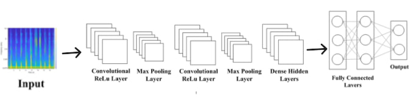
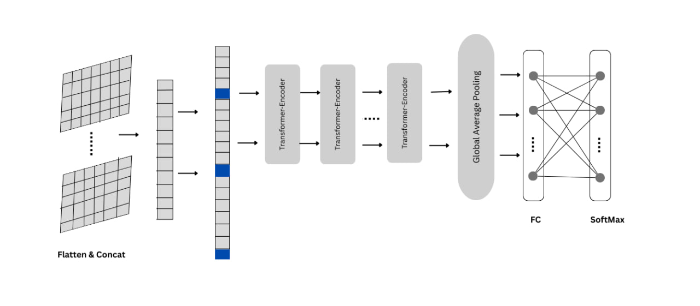

# Enhancing-Speaker-Identification-using-CNN-and-CRNN-Models
This project uses deep learning for speaker identification with CNN, CNN+Transformer, and CNN+BiGRU models trained on the Mozilla Common Voice dataset. Performance is evaluated using sensitivity and specificity, highlighting the effectiveness of sequential models in improving speaker recognition.
# Overview
This project focuses on **speaker identification using deep learning**, evaluating three architectures: **CNN, CNN+Transformer Encoder, and CNN+BiGRU**. The models are trained on the **Mozilla Common Voice dataset** with Mel-spectrograms as input. Performance is analyzed based on **sensitivity and specificity**, highlighting the impact of sequential learning. The findings contribute to optimizing deep learning models for robust speaker recognition in real-world applications.
# Literature review
Speaker identification has evolved from traditional machine learning techniques to deep learning-based approaches for improved accuracy and robustness. Early methods relied on handcrafted feature extraction techniques such as Mel-Frequency Cepstral Coefficients (MFCCs), Perceptual Linear Prediction (PLP), and i-vectors. These features were processed using models like Gaussian Mixture Models (GMMs) and Hidden Markov Models (HMMs) for speaker classification. While effective, these models struggled with noise, variations in speech, and feature extraction complexity, limiting their real-world applications .

Deep learning has significantly enhanced speaker identification by learning feature representations directly from raw audio. Convolutional Neural Networks (CNNs) have been widely adopted due to their ability to capture spatial patterns from spectrogram representations, reducing reliance on manually crafted features. However, CNNs alone do not capture temporal dependencies in speech, leading to the adoption of hybrid architectures that integrate CNNs with sequential models. Bidirectional Gated Recurrent Units (BiGRUs) and Transformer encoders have been introduced to improve long-term feature dependencies in speaker recognition . Recent studies show that these models enhance classification performance, especially in challenging environments.

This study compares three architectures for speaker identification: Baseline CNN, CNN with Transformer Encoder, and CNN with BiGRU, focusing on their performance in terms of sensitivity and specificity rather than just accuracy. Sensitivity measures the model’s ability to correctly identify a speaker, while specificity evaluates how well it avoids false identifications. The research highlights how sequential models like BiGRU outperform pure CNNs, demonstrating better generalization and robustness in speaker classification. The findings emphasize the importance of hybrid deep learning architectures in advancing real-world speaker recognition systems.
# Architectures Used
**A)CNN (Convolutional Neural Network)**

Extracts speaker-specific features from Mel-spectrograms.

Efficient in spatial feature extraction but lacks temporal modeling.

**B)CNN + Transformer Encoder**

Incorporates self-attention to capture global dependencies in speech.

Improves speaker identification by focusing on important time frames.

**C)CNN + BiGRU (Bidirectional Gated Recurrent Unit)**

Enhances sequential modeling by processing speech in both forward and backward directions.

Helps in capturing contextual dependencies for better speaker discrimination.

Each architecture is evaluated based on sensitivity and specificity, ensuring robust and reliable speaker
 

# Feature Importance

• Importance of individual features  

# Model Evaluation

| Class | Basic CNN (Sensitivity) | Basic CNN (Specificity) | CNN + Transformer Encoder (Sensitivity) | CNN + Transformer Encoder (Specificity) | CNN + BiGRU (Sensitivity) | CNN + BiGRU (Specificity) |
|-------|-------------------------|-------------------------|-----------------------------------------|-----------------------------------------|---------------------------|---------------------------|
| 0     | 0.6563                  | 0.9959                  | 0.9375                                  | 1.0000                                  | 1.0000                    | 1.0000                    |
| 1     | 0.0000                  | 0.9964                  | 0.0000                                  | 1.0000                                  | 0.8000                    | 1.0000                    |
| 2     | 0.0000                  | 1.0000                  | 0.9615                                  | 1.0000                                  | 0.9231                    | 1.0000                    |
| 3     | 0.7692                  | 1.0000                  | 0.7692                                  | 0.9960                                  | 0.8462                    | 1.0000                    |
| 4     | 0.4615                  | 0.9960                  | 0.9750                                  | 0.7564                                  | 0.8000                    | 0.9231                    |
| 5     | 0.0000                  | 1.0000                  | 0.9667                                  | 0.9959                                  | 0.9667                    | 1.0000                    |
| 6     | 0.9667                  | 0.9754                  | 0.5676                                  | 0.9789                                  | 0.9189                    | 0.9789                    |
| 7     | 0.7297                  | 0.9409                  | 0.0256                                  | 0.9702                                  | 0.6410                    | 0.9404                    |
| 8     | 0.9487                  | 0.7447                  | 1.0000                                  | 0.9958                                  | 1.0000                    | 0.9916                    |

• HeatMap

# Conclusion
Model gave 90% accuracy for Medical Insurance Amount Prediction using XGBoost. This project demonstrates the effectiveness of machine learning, particularly XGBoost, in accurately predicting medical insurance costs based on key factors. It aims to enhance cost transparency and planning, benefiting both insurers and customers.
